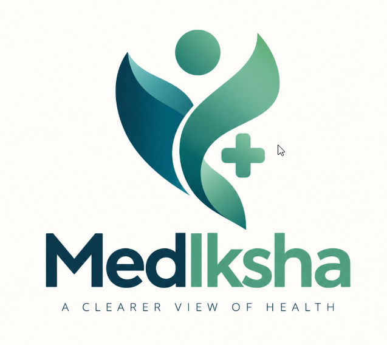

<div align="center">



<h1>Unified Healthcare & Clinical Intelligence Platform</h1>

<p>
  Secure medical documents, patient information,<br>
  and healthcare records in one place.
</p>

<p>
  <a href="https://vercel.com">
    
  </a>

  <a href="https://render.com">
    
  </a>

  <a href="https://www.mongodb.com/atlas">
    
  </a>

  <a href="https://react.dev">
    
  </a>

  <a href="https://vitejs.dev">
    
  </a>

  <a href="https://nodejs.org">
    
  </a>

  <a href="https://abdm.gov.in">
    
  </a>
</p>

</div>

**Mediksha** is a healthcare platform built to make medical information easier to manage and access. 
It brings together **digital health records**, **ICD-11** and **AYUSH terminology**, **clinical symptom analysis**, 
secure doctor-patient data sharing, **nearby hospital discovery**, and a multilingual AI medical assistant 
in one place.

---

## 🌟 Key Features & Modules

### 1.🛡️ ABDM-Compliant Authentication & Identity
- **ABHA ID Integration**: Seamless creation, verification, and management of Ayushman Bharat Health Accounts (ABHA).
- **Aadhaar OTP Flow**: Secure OTP-based registration and login flows with transaction tracking.
- **Role-Based Portals**: Dedicated, permissioned workflows for Patients and Doctors.

### 2. 🪪 Patient Portal & Personal Health Record (PHR)
- **Interactive Health Dashboard**: Vital metrics tracking, timeline of recent consultations, and health summary.
- **Medical Records & Cloud Vault**: Upload, categorize, and view lab reports, prescriptions, and diagnostic documents (powered by Cloudinary).
- **Consent Management**: Granular privacy controls allowing patients to view, approve, or revoke medical record access requests from healthcare providers.
- **Emergency & Nearby Hospital Radar**: Live GPS geolocation with interactive Leaflet radar map to locate 24/7 emergency centers, hospitals, and clinics with direct emergency calling.

### 3. 👨‍⚕️ Doctor Consultation Portal
- **Patient Directory & ABHA Lookup**: Instant patient discovery via ABHA ID or demographic queries.
- **Consent-Driven Access**: Send digital consent requests to access patient medical records and SOCRATES symptom logs.
- **Clinical Review**: In-depth view of accepted patient histories, diagnostic records, and symptom logs.

### 4. 📖  Dual-Coding & CDSS (Clinical Decision Support)
- **WHO ICD-11 Code Explorer**: Direct integration with the WHO ICD-11 API for international disease classification.
- **Ayush NAMASTE Portal**: Standardized terminology search for traditional medicine (Ayurveda, Siddha, Unani).
- **Bidirectional Mapping**: Cross-system mapping bridging modern ICD-11 clinical classifications with traditional Ayush NAMASTE codes.

### 5. 📊  SOCRATES Clinical Symptom Logging
- Structured symptom assessment utilizing the **SOCRATES** framework:
  - **S**ite, **O**nset, **C**haracter, **R**adiation, **A**ssociations, **T**ime Course, **E**xacerbating/Relieving factors, **S**everity.
- Patient submission and direct synchronization with Doctor Review feeds.

### 6. 🌐  Multilingual GenAI Clinical Assistant
- **Groq LLM Integration**: High-speed AI inference powered by modern large language models.
- **Multilingual Support**: Real-time communication and guidance in English, Hindi (हिंदी), Bengali (বাংলা), and Tamil (தமிழ்).
- **Interactive Navigation Helper**: Built-in routing assistant with clickable deep-links to relevant platform pages and tools.

### 7. 🔄  Real-Time Sync & PWA Mobile Experience
- **WebSocket Synchronization**: Real-time Socket.IO broadcasts for instant consent status updates and notifications.
- **Progressive Web App (PWA)**: Installable on iOS/Android devices with offline caching via Service Worker.

---

## ⚙️ Architecture & Technology Stack

| Layer | Technologies |
|---|---|
| **Frontend** | React 19, React Router v7, Vite 8, Tailwind CSS v4, Lucide Icons, Leaflet Maps, Socket.IO Client |
| **Backend** | Node.js, Express 4.x, Mongoose (MongoDB ODM), Socket.IO, Zod Validation, Multer |
| **Database & Cloud** | MongoDB Atlas, Cloudinary (Medical Document Storage) |
| **External APIs** | WHO ICD-11 API, Groq AI API, ABDM Gateway (Sandbox) |
| **Deployment** | Vercel (Frontend SPA), Render (Backend Web Service) |

---

## 📂 Project Structure

```text
SIH/
├── backend/                  # Node.js & Express API Server
│   ├── src/
│   │   ├── app.js            # Express server, Socket.IO & CORS configuration
│   │   ├── module/
│   │   │   ├── auth/         # Authentication, OTP, ABHA registration
│   │   │   ├── user/         # Patient endpoints, CDSS, SOCRATES, Documents
│   │   │   ├── doctor/       # Doctor directory, consent requests, patient profiles
│   │   │   └── genAi/        # Groq GenAI chat controller and safety guardrails
│   │   └── shared/           # Database config, logger, realtime event emitter
│   └── package.json
│
├── frontend/                 # React 19 + Vite SPA & PWA
│   ├── public/               # Manifest, icons, Service Worker (sw.js), offline fallback
│   ├── src/
│   │   ├── module/
│   │   │   ├── auth/         # Login & Register views
│   │   │   ├── user/         # Dashboard, ABHA, Documents, SOCRATES, CDSS
│   │   │   ├── doctor/       # Doctor dashboard, directory, consultation viewer
│   │   │   └── genAi/        # AI chatbot component & multilingual services
│   │   ├── shared/           # API resolver (apiBase.js), UI components, navbar
│   │   ├── routes/           # Application routing (AppRoutes.jsx)
│   │   └── main.jsx
│   ├── vercel.json           # Vercel SPA routing rewrite rules
│   └── vite.config.js
│
├── render.yaml               # Render Blueprint deployment specification
├── vercel.json               # Root Vercel monorepo configuration
├── package.json              # Monorepo scripts
└── README.md
```


## 🤝 Contributors & Module Leads

| Module | Team Members |
|---|---|
| **Authentication & ABDM Module** | Avneet, Alok, Aanchal |
| **User Module** | Ayush, Avneet, Aanchal |
| **Doctor Module** | Alok, Anirudh, Aman |
| **GenAI Module** | Anirudh, Aman |
| **System Architecture** | Ayush, Alok |

---

